<b>НАПОМЕНА:</b> бидејќи го презапишувам предметов, лани имав сличен проект, овај пат го досредив кодот од ланскиот проект и ја додадов играта Snake. Да не дојде до забуни за плагијат.

<h1>1.Опис на апликацијата</h1>
	

Апликацијата која што ја развивав се вика “Менувачница” и комбинира конвертор на валути , едноставен калкулатор и кога нема многу работа во “Менувачницата”, едноставна игра: популарната Snake. 

	 
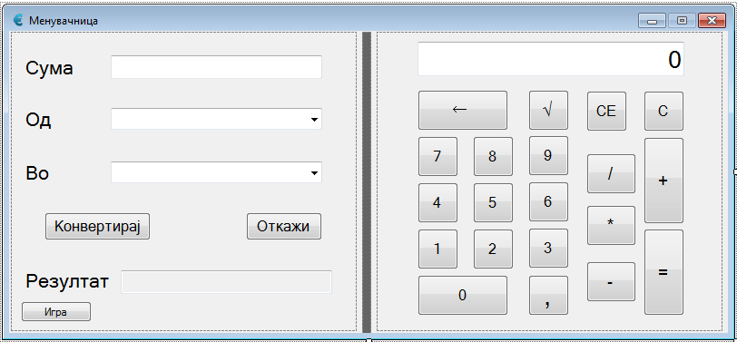

Функционалностите кои оваа апликација ги нуди се во тоа што  комбинира конвертор на валути преку кој може да се конвертираат суми помеѓу 14 валути и истовремено да се вршат математички пресметки со тие суми или калкулаторот да се користи посебно, и исто така кога корисникот сака, да игра игра.
 
<h2>1.1	Како се користи. Функционалности.</h2>

Конверторот на валути се користи така што :
*	За користење на конверторот мора да имате интернет конекција. ( опишано во решение на 
проблемот ).
*	Најпрвин во текст полето за сума се пишува сумата која што сакаме да ја конвертираме. Во ова 
поле не може да се внесат букви или знаци, освен знакот за децимален број (‘ , ’ ), кој што смее да 
се внеси само еднаш.
*	Од листата “Од” се избира валутата од која што сакаме да ја конвертираме сумата која што сме ја 
внесле или пак се пишува валутата па автоматски текстот ќе ни биде дополнет со дадените валути 
од листата.
*	Од листата “Во” избираме во која валута сакаме внесената сума да ни биде конвертирана или пак 
се пишува валутата па автоматски текстот ќе ни биде дополнет со дадените валути од листата.
*	На крајот само го притискаме копчето “Конвертирај” кое се вклучува само доколку имаме внесено 
сума во текст полето за сума и сме избрале од која и во која валута сакаме сумата да ја 
конвертираме.
*	Во текст полето “Резултат” се прикажува резултатот на конвертираната сума. Резултатот стои се 
додека не сакаме да конвертираме нова сума.
*	Доколку нешто сме згрешиле или сакаме да го исчистиме и резултатот и сите полина, тогаш се 
кликнува на копчето “Откажи”.
      
Калкулаторот се користи на следниов начин:
*	Има две можности за внесување на вредности во калкулаторот како и на оператори:
	1.	Преку кликање на копчината.
	2.	Преку тастатура.
*	Внесување на вредности од тастатура во калкулаторот е можно само доколку не е селектирано 
внесување во некое од текстуалните полиња на конверторот. Во сите други случаи доколку 
притиснеме копчиња за бројки од тастатура можеме да внесуваме вредности во калкулаторот.
*	Кога внесуваме вредност во калкулаторот и притиснеме некоја од операциите ( +, -, *, /, 
коренување ) во левиот агол во полето за вредности се прикажува она што сме го внесле.
*	Кога ќе внесеме вредности и она што сакаме да го пресметаме само кликаме на копчето “=” или 
на притискаме на ЕНТЕР од тастатура.
      Целта беше да се направи апликација која ги комбинира овие овие две апликации во едно за 
да може да се конвертираат валути и истовремено да се вршат пресметки со нив.

Играта е популарната игра Snake и нејзиното користење е опишано и во самата форма. Воглавно имаме карактер змија која што се движи и треба да јаде “храна” за да станува се поголема и поголема, но не смее со својата глава да се судри во зидовите на формата и во сопственото тело.
•	Пристапот до играта е преку копчето “игра” кое се наоѓа под полето за резултат од конверторот.

•	Движењето на змијата е овозможено преку стрелките на тастатурата.

•	Со притискање на копчето Enter се започнува со играта.

•	Со притискање на копчето Space се паузира играта.

Целта беше да се направи апликација која ги комбинира овие две апликации во едно за да може да се конвертираат валути и истовремено да се вршат пресметки со нив, како и да се игра игра кога немаме потреба ниту од калкулаторот ниту од конверторот.

<h1>2.Решение на проблемот</h2>

За конверторот и за калкулаторот целиот код се наоѓа во кодот на самата форма ( во класата public partial class Menuvacnica : Form ), додека за играта постојат и две класи.

<h2>2.1 Конвертор на валути</h2>

	
НАПОМЕНА: Функцијата за конверзија на валутите е превземена од интернет. ( 
http://stackoverflow.com/questions/11598318/fetch-currency-rate-in-c-sharp-winform ) . Целта беше да 
се пронајде функција која би ги превземала ратите на валутите од интернет, со тоа што би се 
користеле точни рати кои се менуваат секојдневно. Беше искористено Currency Convertor API на 
Yahoo.
 
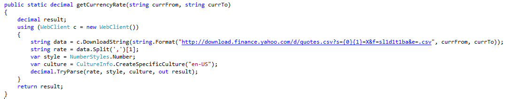

	
Како што може да се види од функцијата, таа прима кратенки од валутите од кои сакаме и кон 
кои сакаме да конвертираме некоја сума. ( пр. getCurrencyRate(“MKD”,”EUR”))Затоа во листата “Од” и “Во” имињата на валутите се напишани и потоа во заграда е 
напишана нивната кратенка.
 
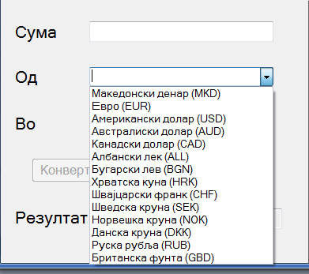

Потоа е креирана функција GetSubstringInBrackets која прима стринг и дава subString од тој 
стринг со зборот кој се наоѓа во загради.

 
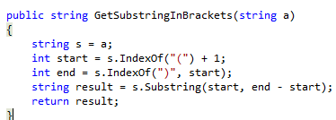

На крајот при клик на копчето “Конвертирај” се земаат податоците од полето за сума и се 
парсираат во децимална вредност, стринговите од избраните валути од листите “Од” и “Во” се 
предаваат на фукцијата за превземање на subString во загради и тие податоци се праќаат на 
функцијата за превземање на ратата која се множи со сумата од полето за сума и на крај резултатот 
се прикажува.

 
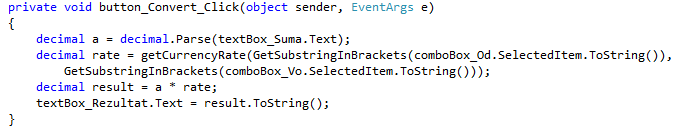

<h2>2.2 Калкулатор</h2>

Копчињата со броеви на калкулаторот сите имаат ист button_click евент. Преку кликање на 
копчето се превзема текстот на тоа копче, а текстот на секое копче е всушност вредноста на тоа 
копче. Исто така и за копчињата со операторите е воведен еден operator_click евент. Операцијата ја 
земаме истот така од текстот на копчето кое е кликанто и ја чуваме во стринг променлива 
дефинирана на почетокот. Исто така на почетокот покрај стринг променливата за чување на 
операцијата, дефинираме и int променлива за чување на вредноста која што сме ја внесле и една 
bool променлива од која што дознаваме дали е притисната некоја операција ( за да се спречи само 
конкатенација на броевите).

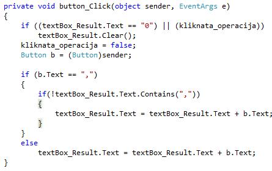  

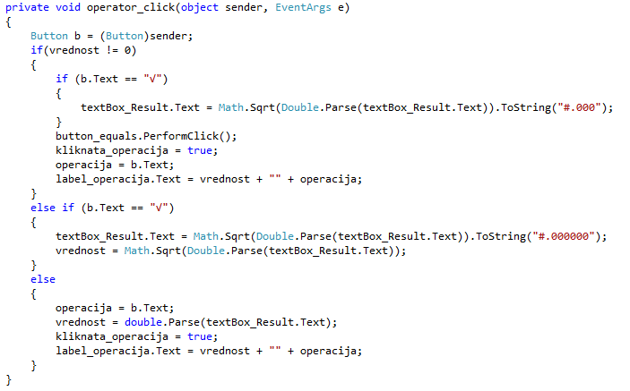

  
При клик на копчето “=”, се превзема вредноста зачувана во променливата вредност 
дефинирана на почетокот и во зависност од притиснатиот оператор ( switch ) се врши операцијата и 
резултатот се прикажува.

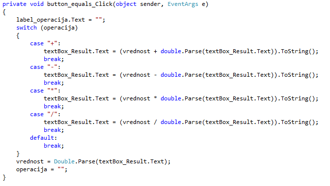

Исто така овозможено е и користење на копчината од тастатура кои соодвеставуваат со копчињата 
од калкулаторот. Тоа е постигнато со key_press евентот на самата форма. Преку e.KeyChar.ToString() е 
креиран switch.
 
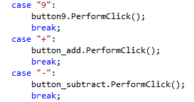

Направено е и копче за бришење на точно еден карактер од текстуалното поле и исто така копче за 
бришење на се, како и копче за бришење само на напишаната вредност. ( Backspace, C, CE).
 

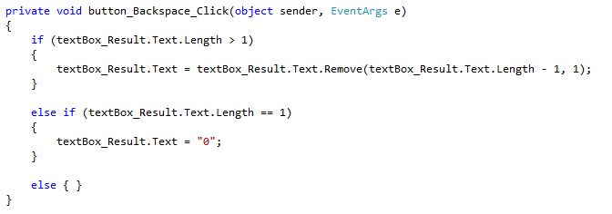

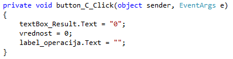

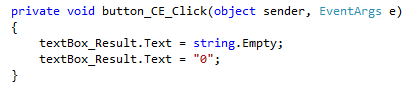

<h2>2.3 Дополнителни функции</h2>

Направена е и функција за проверка дали во тековното текстуално поле има веќе една запирка за да 
се оневозможи внес на не валидни вредности. И исто така да не смее да се внесат букви и некои други знаци.
 
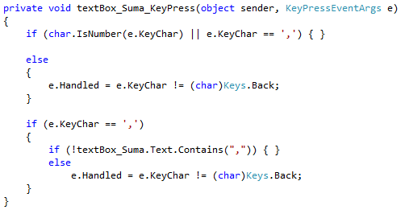

<h2>2.4 Играта Snake</h2>

За имплементација на оваа игра користев две класи: Food.cs и Snake.cs. Големината на самата форма е поставена на 316; 239 , поради фактот 16 пиксели странично и 39 пиксели горе се недостапни за змијата, па затоа и самата лабела каде што се игра играта е со големина 300; 200, а и при самото генерирање на храна се користи таа големина од 300;200.

Класата Food.cs содржи неколку методи. Самата змија и храната се изградени од правоаголници со големина 10x10. Во конструкторот даваме рандом број од функцијата Random и преку методот Generate() рандом ја сетираме позицијата на храната по X и Y оската. Методот Draw() ги сеира само X и Y оските на правоаголникот и преку објекотот од класата Graphics го исполнуваме правоаголникот на храната со кафеава боја.

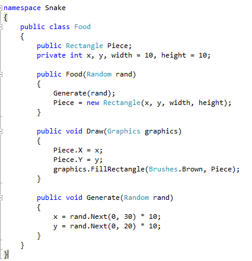

Класата Snake.cs е малку поголема од класата Food.cs. Самата змија е изградена од низа од правоаголници. Во конструкторот кој не прима елементи само се креира змијата со еден правоаголник. Имаме два методи Draw(), еден кој што прима аргументи и еден без. Оној што е без аргументи е само за да се направи “shift” на правоаголниците кога ќе се додава правоаголник во листата, додека пак другиот е со објект од класата Graphics и е за да се пополнат со боја правоаголниците од телото на змијата и тоа со зелена боја.

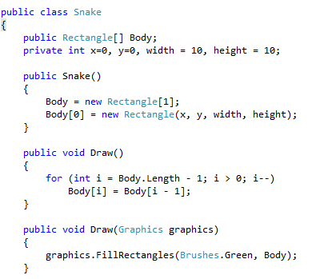

Потоа се имплементирани методите Move() и Grow(). Move() прима аргумент дирекција кој понатака е дефиниран во самата метода, доколку се притисне копчето за десно да дава 0, за долу 1, за лево 2 и за горе 3. Потоа во зависност од бројката се движиме за 10 пиксели (големината на правоаголниците) по X и Y оската. Во методот Grow()  ја трансформираме низата во листа (полесно е додавање елемент во листа отколку во низа), потоа додаваме правоаголник во листата притоа грижејќи се за “shift” на претходните правоаголници. На крај ја враќаме змијата во низа ( полесно за индексирање на правоаголниците за претходните методи).

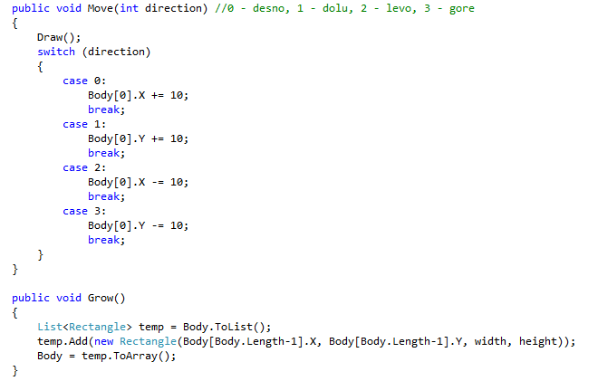

Во кодот на формата најпрво креираме тајмер, змија, храна, рандом број за генерирање, објект од Graphics, score (ќе брои колку храна сме голтнале) и дирекција која на почеток е поставена на 0 ( десно ). Тајмерот е поставен на 75 милисекунди, од претходни проекти искористено дека 75 е најиделано за тежина на самата игра и движењето на змијата. Тајмерот исто така е поставен и да се update-ира со наш метод Update.

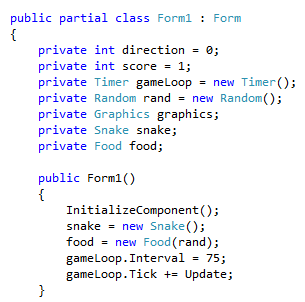

Од евентите на формата ги имаме KeyDown и Paint. Преку KeyData дознаваме кое копче е притиснато и со користење на лабелата при притискање на Ентер, се стартува тајмерот и се прави видливоста на лабелата да е неточна. При притискање на Space, се паузира тајмерот, а при Escape се затвора формата.

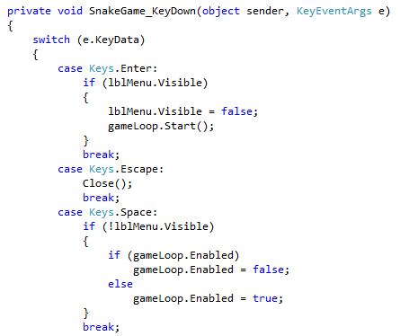

Доколку се притиснат некој од стрелките на тастатурата, се поставува да не може да се движи змијата во спротивен правец (лево-десно, горе-долу) и се поставува точната дирекција во согласност со кодот за движење на змијата ( 0 – десно, 1 – долу, 2 – лево, 3-горе ) .

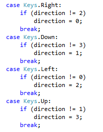

При евентот Paint само се генерира објект од класата Graphics и се праќа како аргумент во методите Draw(), и на змијата и на храната.

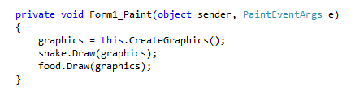

Методот Update(), се грижи за score-от кој се прикажува горе на формата, и за самото движење усогласено со тајмерот. Дополнително, се проверува колизијата која доколку се случи се рестартува формата со методот кој на крајот го дефиниравме Restart(). Се користи готовата функција IntersectsWith за проверка дали има колизија со зидовите на формата или со самото тело на змијата. На крајот доколку има колизија со парче храна се зголемува score-от, расте змијата преку методот Grow(), и се генерира ново парче храна.

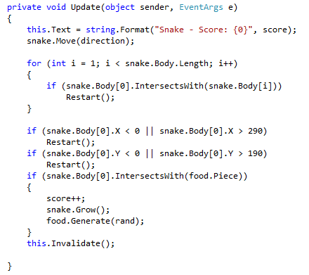

На крај методот Restart() се грижи за стопирање на тајмерот, чистење на објектите од формата и поставување на почетните бои на формата како и за креирање на нова змија и ново парче храна, сетирање на позициите и score-от и поставување на видливоста на лабелата. Ова се случува доколку направиме колизија.

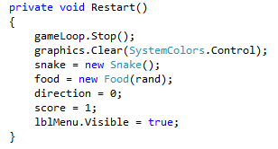
